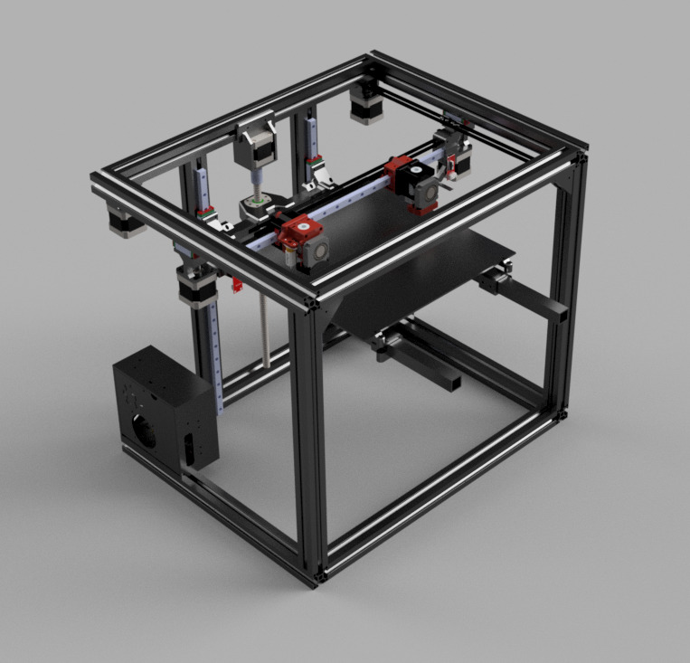

# Complicator 3000
Possibly the most complicated 3D printer in existance.

I worked on this project a couple of years ago and it became way too complex and essentialy useless.
I made a new, better and simpler 3D printed, which you can find [here](), but I figured someone might find this project interesting anyways - therefore I decided to post everything here.
Btw, you need Fusion 360 to open the files.

### Note
When designing this printer, I used some standard 3D parts from grabcad. If you happen to find the origin of any of these parts, feel free to open a pull request with credits to them.

**Full disclosure:** I'm not the owner of any of these parts.